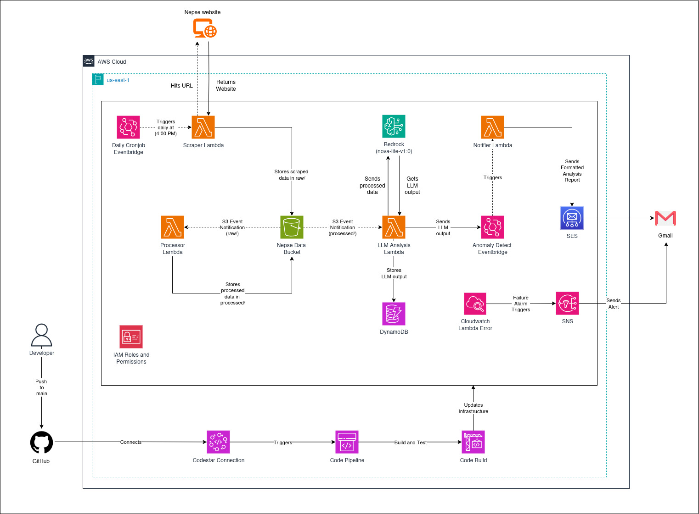

# **Serverless Data Processing and Analyzing Pipeline**

**Github Repo Link :**
- [Nepse Project](https://github.com/suzal777/nepse_project) : https://github.com/suzal777/nepse_project
- [CodePipeline](https://github.com/suzal777/codepipeline_terraform) : https://github.com/suzal777/codepipeline_terraform

---

## **Objective**

A serverless architecture on AWS that scrapes, processes and analyzes Nepse stock data with Bedrock LLM, stores results in DynamoDB and sends anomaly alerts via SES, all deployed with Terraform and CodePipeline.

---

## **Architecture Diagram**

---

## **System Overview**

### **Workflow :**

**1. Daily Trigger**

- At 4 PM daily, an EventBridge cronjob triggers the Scraper Lambda.
- This Lambda scrapes Nepse website, parses daily stock prices into json and stores the result in the raw/ folder of an S3 bucket.
- The Scraper Lambda uses a lambda layer to package dependencies efficiently.

**2. Processing**

- When a new file lands in raw/, an S3 event notification triggers the Processor Lambda.
- The Processor Lambda:
    - Selects only the required stock columns.
    - Filters out mutual funds (stored under rejects/).
    - Saves valid data under processed/.
    - Logs row counts (processed vs rejects) into metadata/.

**3. Analysis**

- When a new file is stored in processed/, an S3 event notification triggers the LLM Analysis Lambda.
- The LLM Analysis Lambda:
    - Sends the processed json to Amazon Bedrock LLM.
    - Stores the LLM’s analysis report in DynamoDB.
    - If anomalies are detected, it publishes an event to the EventBridge EventBus.

**4. Notification**

- The EventBus triggers the Notifier Lambda if anomalies are present.
- This Lambda formats the LLM report into a clean HTML/CSS email and sends it to Gmail via SES.

**5. Data Lifecycle**

- S3 data is managed with lifecycle rules:
    - raw/ and rejects/ expire quickly in 1 month.
    - processed/ and metadata/ transition to Glacier after 1 month for cost optimization.

**6. Monitoring & Alarms**

- CloudWatch Alarms are configured for each Lambda.
- On any failure, alarms trigger an SNS topic that sends an email notification.

---

### **Infrastructure Management**

- Entire infrastructure (S3, Lambdas, DynamoDB, SES, EventBridge, IAM roles, etc.) is managed using Terraform.
- All code (infra + lambda functions) is stored in GitHub.

---

### **CI/CD Setup**

**1. GitHub Branching Strategy**

- Repo has 3 branches: main, uat, dev.
- A git-back sync workflow ensures if code is pushed directly to uat, a PR is auto-created from uat to dev.

**2. AWS CodePipeline**

- Repo is connected via CodeStar Connection.
- On merges to main, CodePipeline runs.

**CI Stage :**

- Run terraform fmt and terraform validate.
- Run pytest unit tests for Lambda functions.

**CD Stage :**

- Deploy Terraform-managed infrastructure.
- Deploy Lambda code with conditional dependency installation:
    - Dependencies (requirements.txt) only reinstalled if changes are detected.
    - Speeds up pipeline by avoiding unnecessary Lambda redeployment.
- Dependencies are cached in an S3 bucket for reuse across builds.

---

## **Step by Step Setup Guide**

**1. Prerequisites**

First of all, ensure the following dependencies are installed and configured:

- AWS CLI v2 with credentials configured using command `aws configure`.
- Terraform v1.13 installed and available in your PATH.
- Python 3.10/3.11 installed (for Lambda local testing).
- Git installed (to clone the repository).
- An active AWS account with permissions to create IAM roles, Lambda, S3, DynamoDB, SES, EventBridge, CloudWatch, and CodePipeline resources.
- Verified SES Email Addresses (both sender and receiver must be verified in SES sandbox mode).

**2. Clone the Repository**

Then clone the repo using following command:

- `git clone https://github.com/suzal777/nepse_project.git`
- `git clone https://github.com/suzal777/codepipeline_terraform`
- `cd nepse_project`

**3. Update Terraform Configurations**

- Edit variables.tf with environment specific values (like S3 bucket names, DynamoDB table name, other resource names, email address for SES, Tags, etc).
- If needed, adjust resource configurations directly in Terraform files (like lifecycle policies, cloudWatch alarm thresholds, etc.).

**4. Initialize and Apply Terraform**

This will deploy the complete infrastructure in AWS.

- `terraform init`
- `terraform fmt`
- `terraform validate`
- `terraform plan`
- `terraform apply`

**5. Verify SES Configuration**

- Log into the AWS Console then to SES Identities.
- Ensure both sender (SES_EMAIL_FROM) and receiver (SES_EMAIL_TO) emails are verified.

**6. CI/CD with CodePipeline**

- First update the variables.tf files and other resource configs accordingly.
- Then deploy the terraform using terraform commands.
- After deployment, go to the AWS Console then to Developer Tools and then Connections and verify the CodeStar connection status with your GitHub repo.
- Copy the connection arn and update it in variables.tf.
- Run Terraform again to update codePipeline with the correct connection arn.
- Push a small change in the main branch to verify the pipeline runs end-to-end.

---

## **Purpose of Lambda Functions**

### **1. Scraper Lambda**

This function is responsible for collecting the daily stock market data from the target Nepse website. It runs when triggered by the EventBridge cron job at 4 PM. The Lambda makes an http request to the stock price page and parses the HTML table using BeautifulSoup.

It extracts all rows of the table, cleans the values (converts numbers where possible), and structures them as json data. Once the raw stock data is prepared, it is stored in the S3 bucket under raw/ folder with a unique timestamped filename for traceability.

This Lambda also uses a retry mechanism in case of temporary network failures and generates a correlation_id for logging and debugging. In short, it acts as the entry point of the whole pipeline by fetching raw stock market data and saving it to S3 for further processing.

### **2. Processor Lambda**

This function is triggered automatically whenever new raw data lands in the raw/ folder of the S3 bucket. Its role is to clean and structure the raw stock market data scraped earlier.

It reads the raw json file from S3, selects only the required columns like Symbol, Open, High, Low, Close, LTP, Volume, Turnover, Diff %, and filters out mutual fund stocks (anything with close price below 20). The valid rows are stored in the processed/ folder, while the filtered or invalid rows are stored in the rejects/ folder along with rejection reasons.

Additionally, the Lambda generates a metadata file inside the metadata/ folder that contains counts of total raw rows, processed rows, rejected rows, and file references for traceability.

In summary, this Lambda acts as the data cleaner and transformer in the pipeline, ensuring only valid and structured stock data moves forward for further analysis.

### **3. LLM Analysis Lambda**

This function is triggered automatically whenever a new file is added inside the processed/ folder of the S3 bucket. Its job is to take the cleaned stock data and generate insights using an LLM hosted on Amazon Bedrock.

The Lambda first reads the processed stock json from S3 and also fetches the corresponding metadata file to know the row counts. Then, it builds a carefully crafted financial analysis prompt and sends the data to the Bedrock model (default: amazon.nova-lite-v1:0). The model returns structured insights divided into three sections:

- MARKET SUMMARY : A concise overview of the day’s stock market sentiment and key movers.
- ANOMALIES : A list of unusual trading patterns with symbol, turnover, price change, and reasons.
- SUGGESTIONS : Actionable insights split into opportunities and risks.

The Lambda parses this response, extracts the three sections and saves them into DynamoDB with correlation details for traceability.

If anomalies are found, the Lambda sends an event to EventBridge which later triggers the Notifier Lambda to send alerts via email.

In short, this Lambda acts as the AI brain of the pipeline, it converts raw market data into actionable intelligence and triggers alerts when anomalies are detected.

### **4. Notifier Lambda**

This Lambda acts as the communication layer of the system and is triggered whenever the LLM Analysis Lambda detects anomalies and publishes an event to Amazon EventBridge. 

Its primary role is to take the structured anomaly event, extract details such as the market summary, detected anomalies, actionable suggestions, and row counts and transform them into a professional and styled HTML report. 

The Lambda organizes the content into sections like Processing Summary, Market Overview, Anomalies, Suggestions, and Traceability information, making the report easy to understand and visually clear. 

Once formatted, the Lambda sends this report through Amazon SES to the designated recipients. Environment variables define the sender and recipient addresses, ensuring flexibility. In case of errors during SES delivery, the Lambda logs the issue and provides a structured error response for debugging. 

In essence, this function ensures that the daily stock market insights are not only analyzed but also effectively communicated to stakeholders in a timely manner.

---

## **Roles of EventBridge**

EventBridge is used at two key points in the system. First, a scheduled rule (cron job) triggers the scraper Lambda function daily at 4 PM, ensuring the stock market data is always captured consistently without manual intervention. 

Second, EventBridge is also used as an alerting mechanism: whenever the analysis Lambda detects anomalies in the processed stock data, it sends an event to the EventBridge bus. This event then triggers the notifier Lambda, which formats and sends the anomaly report via SES. 

By limiting EventBridge to scheduling and alert handling, the design stays simple while still leveraging its event-driven capabilities for automation and anomaly response.

---

## **Security Measures Taken**

The project follows the principle of least privilege by granting each Lambda function only the permissions it requires to perform its tasks. For example, the Scraper and Processor Lambdas are granted read and write access to S3 buckets via a dedicated IAM role, while the LLM Analysis Lambda has S3 read-only access and a custom inline policy allowing only PutItem access to DynamoDB. 

Sensitive data at rest in S3 and DynamoDB is protected using server-side encryption (SSE), ensuring that all raw, processed, and metadata files, as well as analysis results, are encrypted.

---

## **Error Handling & Retry Strategies**

Each Lambda function in the pipeline implements robust error handling and retry mechanisms to ensure reliable execution. For example, the Scraper Lambda retries HTTP requests up to three times with exponential backoff if fetching the source URL fails, logging each failed attempt with a unique correlation ID for traceability. 

The Processor Lambda validates input data from S3 and gracefully separates invalid or rejected records, storing them in a dedicated rejects/ folder, preventing pipeline failure due to malformed rows. 

The LLM Analysis Lambda captures parsing errors and DynamoDB write failures, logging detailed error messages and returning structured error responses. 

EventBridge triggers and S3 event notifications are configured with built-in retry capabilities, ensuring that transient errors or temporary unavailability of resources do not result in data loss or missed executions.

---

## **Instructions for Testing with Sample Input Data**

To test the NEPSE market data pipeline, you can either manually trigger the Scraper Lambda via the AWS CLI using the command 
 `aws lambda invoke --function-name nepse_scraper_lambda --payload '{}' response.json` 
 or upload sample raw data directly to the S3 bucket under the raw/YYYY-MM-DD/ prefix. 

A representative example of raw data is a JSON array containing multiple stock records, each with fields like { S.No, Symbol, Conf., Open, High, Low, Close, LTP, Close - LTP, Close - LTP %, VWAP, Vol, Prev. Close, Turnover, Trans., Diff, Range, Diff %, Range %, VWAP %, 120 Days, 180 Days, 52 Weeks High, 52 Weeks Low }.

 Once the sample data is uploaded, the Processor Lambda is automatically triggered by the S3 event notification. This results in processed data being stored in the processed/YYYY-MM-DD/ prefix, rejected records (if any) in rejects/YYYY-MM-DD/, and metadata under metadata/YYYY-MM-DD/. After processing, the LLM Analysis Lambda gets invoked using the processed file key to generate structured market insights, which are saved in DynamoDB. If anomalies are detected, the EventBridge rule triggers the Notifier Lambda to send an SES email containing the market summary, anomalies, and suggestions. Note that the scheduled workflow also runs automatically every day at 4:00 PM via EventBridge cron jobs.

---

## **AWS Bedrock Nova Lite v1.0 Cost Analysis**

### **Pricing Structure**

Nova Lite is $0.00006 per 1,000 input tokens and $0.00024 per 1,000 output tokens. 

### **Token Estimation**

**Input Analysis:**
 
- Prompt: ~300 tokens
- Stock market data (280 companies): ~8,000-10,000 tokens
- Total Input per analysis: ~10,000 tokens

**Output Analysis:**

- Market Summary: ~150 tokens
- Anomalies section: ~200 tokens
- Suggestions section: ~150 tokens
- Total Output per analysis: ~500 tokens

### **Cost Calculations**

**Per Analysis:**

- Input cost: (10,000 tokens ÷ 1,000) × $0.00006 = $0.0006
- Output cost: (500 tokens ÷ 1,000) × $0.00024 = $0.00012
- Total per analysis: $0.00072

**Daily Usage Scenarios:**

- Daily Cost : $0.00072
- Monthly Cost : $0.022
- Annual Cost : $0.26

---

## **Deliverables**

**Github Repo Link :**
- [Nepse Project](https://github.com/suzal777/nepse_project)
- [CodePipeline](https://github.com/suzal777/codepipeline_terraform)

**Sample Input and Output Data :**
- [Raw JSON](Data/raw.json) 
- [Processed JSON](Data/processed.json) 
- [Reject JSON](Data/rejects.json) 
- [Metadata JSON](Data/metadata.json)

## **Screenshots**

### **Processed S3 data (raw/, processed/, rejects/)**

 

 
 

 

---

### **DynamoDB is populated with results**

 

---

### **SES email with analysis summary**

 

---

### **CloudWatch alarm firing on failure**

---